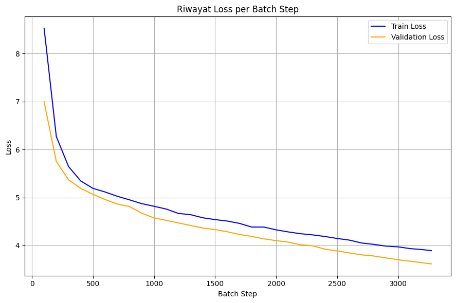

# Tugas Eksplorasi Arsitektur Transformer Mesin Transalation English To Russian

## Mata Kuliah : Pembelajaran Mendalam RB
## Kode : IF25-40401
## Anggota :
1. Ahmad Faqih Hasani 122140005
2. Reynaldi Cristian Simamora 122140116

### Dataset: English-Russian dictionary for machine translate
https://www.kaggle.com/datasets/hijest/englishrussian-dictionary-for-machine-translate

---

## A. Arsitektur Transformer

Arsitektur Transformer merupakan model sequence-to-sequence yang dibangun atas dua komponen utama, yaitu Encoder dan Decoder, yang masing-masing tersusun dari tumpukan blok identik. Setiap blok Encoder terdiri atas Multi-Head Attention dan Feed-Forward Network, yang dihubungkan melalui residual connection dan layer normalization untuk menjaga stabilitas pelatihan. Sementara itu, Decoder memiliki struktur serupa dengan tambahan mekanisme masked self-attention guna mencegah akses terhadap token masa depan serta encoder-decoder attention untuk menghubungkan konteks input dan output.

Proses kerjanya dimulai dengan pengubahan token menjadi vektor embedding, kemudian ditambahkan positional encoding berbasis fungsi sinus dan kosinus untuk menyertakan informasi urutan. Data ini kemudian diproses berlapis melalui Multi-Head Attention, yang memproyeksikan embedding ke beberapa head agar berbagai hubungan semantik dapat ditangkap secara paralel. Hasil setiap head digabungkan dan dilewatkan ke feed-forward network untuk menghasilkan representasi yang lebih dalam. Pada bagian Decoder, representasi dari Encoder digunakan bersama input target untuk menghasilkan urutan keluaran secara autoregresif.

| **Komponen**                       | **Deskripsi Teknis**                                                                                                                                                                                                                                       |
| ---------------------------------- | ---------------------------------------------------------------------------------------------------------------------------------------------------------------------------------------------------------------------------------------------------------- |
| **Input & Target**                 | **Input:** `torch.Size([2, 12])` — batch 2 sampel × 12 token. <br> **Target:** `torch.Size([2, 12])` — panjang urutan output sama dengan input.                                                                                                            |
| **Model Utama**                    | `Transformer` terdiri atas dua blok utama: **Encoder** dan **Decoder**, diakhiri dengan **Fully Connected Layer** untuk menghasilkan token output.                                                                                                         |
| **Encoder – Embedding**            | `Embedding(11, 512)` — memetakan 11 token unik menjadi vektor berdimensi 512.                                                                                                                                                                              |
| **Encoder – Positional Encoding**  | Menambahkan informasi urutan posisi token. <br> Menggunakan `Dropout(p=0.1)` untuk regularisasi.                                                                                                                                                           |
| **Encoder – 6 Transformer Blocks** | Tiap blok berisi:<br>• **Multi-Head Attention:** 8 head (`query/key/value` → 64 dim).<br>• **Feed Forward:** Linear(512→2048→512) + ReLU.<br>• **LayerNorm(512)**.<br>• **Dropout(0.2)**.                                                                  |
| **Encoder – Output Dropout**       | Dropout global `p=0.2` setelah seluruh blok encoder.                                                                                                                                                                                                       |
| **Decoder – Embedding**            | `Embedding(11, 512)` — identik dengan encoder untuk menjaga konsistensi dimensi.                                                                                                                                                                           |
| **Decoder – Positional Encoding**  | Menyisipkan konteks posisi token target, menggunakan `Dropout(p=0.1)`.                                                                                                                                                                                     |
| **Decoder – 6 Decoder Blocks**     | Tiap blok terdiri dari:<br>• **Self-Attention:** menghubungkan antar token target.<br>• **Cross-Attention Block:** menghubungkan output encoder dengan decoder.<br>• **Feed Forward:** Linear(512→2048→512).<br>• **LayerNorm(512)** dan **Dropout(0.2)**. |
| **Cross-Attention (di Decoder)**   | Menggunakan `TransformerBlock` dengan mekanisme `query-key-value` untuk menghubungkan konteks sumber (encoder) dan target (decoder).                                                                                                                       |
| **Output Layer (FC)**              | `Linear(512 → 11)` — memetakan hasil akhir ke distribusi probabilitas 11 token output.                                                                                       
---
## B. Konfigurasi Arsitektur
| **Kategori**                | **Parameter**                        | **Nilai** | **Deskripsi Singkat**                               |
| --------------------------- | ------------------------------------ | --------- | --------------------------------------------------- |
| **Arsitektur Model**        | `DIMENSI_EMBEDDING`                  | 256       | Ukuran vektor representasi token.                   |
|                             | `JUMLAH_BLOCK`                       | 3         | Jumlah tumpukan blok Encoder–Decoder.               |
|                             | `HEADS`                              | 8         | Jumlah *attention heads* paralel.                   |
|                             | `FAKTOR_EKSPANSI`                    | 4         | Pengali dimensi untuk *Feed-Forward Network*.       |
|                             | `DROPOUT`                            | 0.1       | Probabilitas *dropout* untuk regularisasi.          |
|                             | `PANJANG_MAKS_SEKUENS`               | 5000      | Panjang maksimum untuk *Positional Encoding*.       |
| **Hyperparameter Training** | `BATCH_SIZE`                         | 100       | Jumlah sampel per iterasi pelatihan.                |
|                             | `NUM_EPOCHS`                         | 1         | Jumlah siklus pelatihan penuh.                      |
|                             | `LEARNING_RATE`                      | 0.0001    | Laju pembelajaran pada *optimizer* Adam.            |
| **Tokenisasi & Data**       | `MIN_FREQ`                           | 2         | Frekuensi minimum token agar tidak diganti `<unk>`. |
|                             | `UNK_IDX, PAD_IDX, BOS_IDX, EOS_IDX` | —         | Indeks token khusus untuk konsistensi data.         |

Konfigurasi ini dirancang untuk menjaga efisiensi pelatihan, stabilitas model, dan reproduksibilitas hasil pada arsitektur Transformer.
---
## C. Data Preparation

Proses **Data Preparation** bertujuan untuk menyiapkan korpus teks agar dapat diproses oleh model Transformer. Tahapan ini mencakup pembuatan *tokenizer*, pembangunan *vocabulary*, konversi teks menjadi tensor numerik, serta pembentukan *dataset* dan *batch* siap latih.

| Langkah | Komponen | Deskripsi Teknis |
|:--:|:--|:--|
| **1** | **Dataset Loading** | Mengunduh dataset *English-Russian Dictionary for Machine Translation* menggunakan `kagglehub.dataset_download`. File dimuat dengan `pandas.read_csv` (format TSV) dan dibersihkan menggunakan `dropna()` serta `drop_duplicates()` untuk memastikan keunikan pasangan kalimat. |
| **2** | **Train-Test Split** | Dataset dibagi menjadi dua bagian menggunakan `train_test_split(df, test_size=0.1)` — 90% data untuk pelatihan dan 10% untuk validasi, guna mengukur kemampuan generalisasi model. |
| **3** | **Tokenizer Initialization** | Fungsi `load_tokenizers()` memuat model bahasa **spaCy** untuk Inggris (`en_core_web_sm`) dan Rusia (`ru_core_news_sm`). Dua fungsi pembungkus `tokenize_en()` dan `tokenize_ru()` digunakan untuk memecah teks menjadi daftar token huruf kecil sesuai bahasa. |
| **4** | **Vocabulary Construction** | Fungsi `build_custom_vocab()` menghitung frekuensi token menggunakan `collections.Counter`, memfilter kata berdasarkan ambang batas `MIN_FREQ`, dan menambahkan token khusus `<unk>`, `<pad>`, `<sos>`, `<eos>`. Hasilnya adalah objek `CustomVocab` yang menyediakan pemetaan dua arah (`stoi`, `itos`). |
| **5** | **Text Transformation** | Fungsi `text_transform()` mengubah kalimat mentah menjadi tensor numerik dengan tahapan: tokenisasi → penambahan `<sos>` & `<eos>` → konversi token ke indeks numerik → konversi akhir ke `torch.Tensor`. |
| **6** | **Dataset Wrapper** | Kelas `EngRuDataset` menyimpan pasangan kalimat Inggris–Rusia dan memungkinkan pengambilan data per baris melalui `__getitem__`. Struktur ini digunakan oleh `DataLoader` untuk iterasi efisien selama pelatihan. |
| **7** | **Batch Collation** | Fungsi `collate_fn()` menerapkan `text_transform` pada setiap pasangan kalimat, kemudian menggunakan `pad_sequence` untuk menyamakan panjang tensor dengan token `<pad>`. Batch hasilnya siap dikirim ke `DEVICE` (GPU) untuk proses *training*. |
---
## D. Fungsi Pelatihan dan Evaluasi

Bagian ini menjelaskan proses utama dalam pelatihan model Transformer, mencakup inisialisasi bobot, pembaruan parameter, evaluasi performa, serta penyimpanan hasil pelatihan.

### 1. `initialize_weights`
- Menginisialisasi bobot model dengan **Xavier/Glorot initialization** (`nn.init.xavier_uniform_`).
- Menjaga kestabilan varians sinyal agar tidak terjadi *vanishing* atau *exploding gradient* pada tahap awal pelatihan.

### 2. `train_epoch`
- Melatih model untuk satu *epoch* penuh.  
- Langkah utama:
  - `model.train()` → mengaktifkan mode pelatihan.  
  - Menerapkan **Teacher Forcing**:
    - `trg_input`: kalimat target tanpa token terakhir.  
    - `trg_output`: kalimat target tanpa token awal.  
  - *Forward pass*: `logits = model(src, trg_input)`.  
  - *Backward pass*: menghitung gradien (`loss.backward()`), menerapkan **Gradient Clipping**, dan memperbarui bobot (`optimizer.step()`).  
  - Menyimpan dan menghitung rata-rata *loss* setiap *batch*.  
- **Output:** `avg_loss`, `batch_losses`.

### 3. `evaluate_epoch`
- Mengevaluasi performa model pada data validasi tanpa pembaruan bobot.
- Langkah utama:
  - `model.eval()` → mengaktifkan mode evaluasi.  
  - `torch.no_grad()` → mematikan perhitungan gradien.  
  - Menghitung *validation loss* dan *accuracy*:
    - `preds = logits.argmax(dim=-1)` → prediksi token terbaik.  
    - `non_pad_mask = (trg_output != PAD_IDX)` → abaikan token `<pad>`.  
    - `avg_acc` dihitung dari rasio prediksi benar terhadap total token valid.  
- **Output:** `avg_loss`, `avg_acc`.

### 4. Training Loop & Periodic Evaluation
- Proses utama pelatihan dan evaluasi berjalan secara bersamaan:
  - Iterasi setiap *epoch* dan *batch*.  
  - Setiap 100 *batch* atau akhir *epoch*, fungsi `evaluate_epoch` dipanggil untuk mengukur performa model.  
  - Hasil *TrainLoss*, *ValLoss*, dan *ValAcc* disimpan dalam `history` untuk keperluan visualisasi.  
  - *Gradient clipping* diterapkan di setiap iterasi untuk stabilitas pelatihan.

### 5. Model Saving
- Setelah seluruh *epoch* selesai, model disimpan menggunakan `torch.save()`.
- Hasil akhir:
  - File model `.pth` siap digunakan untuk inferensi atau pelatihan lanjutan.  
  - Metrik pelatihan (`TrainLoss`, `ValLoss`, `ValAcc`) tersimpan untuk analisis performa.
### 6. Grafik Loss Training dan Akurasi Validasi per Batch
Proses pelatihan model Transformer berlangsung selama satu epoch dengan evaluasi validasi setiap 100 batch. Sepanjang pelatihan, nilai Train Loss mengalami penurunan signifikan dari 8.525 menjadi 3.892, diikuti penurunan Validation Loss dari 6.993 menjadi 3.616, yang menunjukkan konvergensi model berjalan stabil dan efektif. Akurasi validasi juga meningkat konsisten dari 13.13% hingga mencapai 47.48%, menandakan kemampuan model dalam mempelajari hubungan sekuens input–output semakin baik. Secara keseluruhan, hasil ini menggambarkan proses optimisasi yang berhasil meningkatkan performa model terhadap data pelatihan maupun validasi.

#### a. Training Loss

#### b. Akurasi Validasi


---

## E. Inferensi
Inferensi digunakan untuk menerapkan model Transformer yang telah dilatih agar dapat menerjemahkan kalimat baru. Proses ini memuat bobot model, menjalankan *encoder-decoder*, dan menghasilkan teks terjemahan akhir.
1. Tahap pertama memuat model yang sudah dilatih dan disimpan yaitu transformer_eng_ru_final.pth
2. Memuat fungsi `(translate_sentence)`
    - Tokenisasi Input. Kalimat diubah menjadi daftar token dan dikonversi menjadi indeks numerik dari vocab_en, lalu dibungkus dengan token khusus <sos> dan <eos>.
    - Membuat Tensor & Mask. Input diubah menjadi tensor dan dibuat mask agar padding tidak memengaruhi hasil perhitungan.
    - Encoder Forward Pass (Satu Kali). Kalimat sumber dijalankan sekali pada encoder untuk menghasilkan representasi kontekstual.
    - Loop Decoder (Greedy Search)
        - Dimulai dengan token <sos>.
        - Model memprediksi satu token setiap iterasi menggunakan decoder.
        - Token baru ditambahkan hingga muncul <eos> atau batas maksimum (max_len).
    - Konversi ke Teks Output. Semua indeks hasil prediksi dikonversi kembali ke token menggunakan vocab_ru, lalu digabung menjadi kalimat akhir tanpa token khusus.

### Contoh Inferensi

Berikut contoh penerapan fungsi `translate_sentence` untuk menerjemahkan kalimat sederhana dari bahasa Inggris ke bahasa Rusia menggunakan model Transformer yang telah dilatih.

```python
kalimat_1 = "Hi, Friends"
kalimat_2 = "How Are You?"
kalimat_3 = "I Love You"

translation_1 = translate_sentence(inference_model, kalimat_1, vocab_en, vocab_ru, tokenize_en, DEVICE)
print(f"Source (EN): {kalimat_1}")
print(f"Model (RU): {translation_1}\n")

translation_2 = translate_sentence(inference_model, kalimat_2, vocab_en, vocab_ru, tokenize_en, DEVICE)
print(f"Source (EN): {kalimat_2}")
print(f"Model (RU): {translation_2}\n")

translation_3 = translate_sentence(inference_model, kalimat_3, vocab_en, vocab_ru, tokenize_en, DEVICE)
print(f"Source (EN): {kalimat_3}")
print(f"Model (RU): {translation_3}\n")
```

Output yang dihasilkan adalah sebagai berikut.
```
Source (EN): Hi, Friends
Model (RU): пожалуйста <unk> .

Source (EN): How Are You?
Model (RU): как ты ?

Source (EN): I Love You
Model (RU): я не тебя .
```

---
